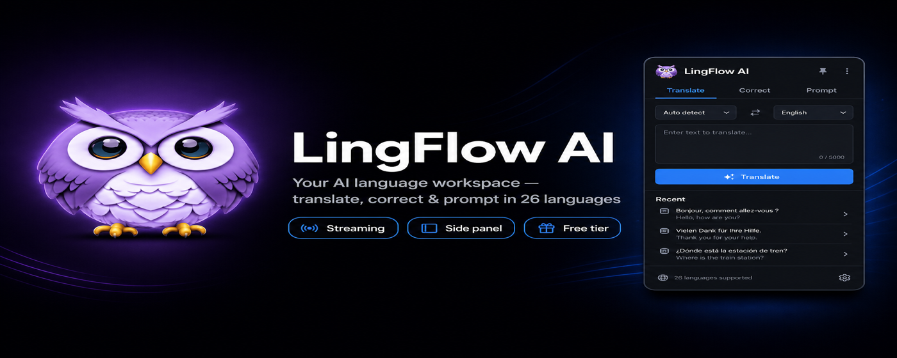

<div align="center">



<h1>🌐 LingFlow AI</h1>

<p><strong>Your AI language workspace — translate, correct, and prompt-engineer in 26 languages, right in your browser.</strong></p>

<p>
  <a href="#-installation"></a>
  <a href="LICENSE"></a>
  
  
  
</p>

<p>
  <a href="#-installation">Install</a> ·
  <a href="#-features">Features</a> ·
  <a href="#-usage">Usage</a> ·
  <a href="#-build-from-source">Build from source</a> ·
  <a href="#-privacy">Privacy</a>
</p>

</div>

---

LingFlow AI is an open-source, Manifest V3 browser extension that brings AI translation, grammar correction, OCR, text-to-speech, and image-prompt engineering into a single workspace. Select text on any page, capture a screenshot, or work from the popup or side panel — results stream in token by token, powered by **Chrome's built-in AI (Gemini Nano) running on-device for free**, or your own **OpenAI** / **Google Gemini** key for advanced features.

## ✨ Highlights

- 🆓 **Free & private on-device tier** — translate, correct, and prompt with Chrome's built-in AI (Gemini Nano). No API key, no network, no author-hosted servers.
- 🌍 **Translate across 26 languages** with auto-detect, language swap, and DeepL-style tone control (Auto · Formal · Casual · Business · Friendly).
- ✏️ **Fix & rewrite text** — set the same source and target language to clean up grammar and style while preserving meaning.
- 🎨 **Prompt engineering** for AI image models — Photo, Graphic, and Expand modes for photorealistic scenes, illustrations, and prompt cleanup.
- 📸 **OCR & screenshot translation** — drag to capture any region; get transcription and translation side by side.
- 🌐 **On-page translation** — select text anywhere, translate in a floating tooltip, and replace it in place (inputs, textareas, contenteditable).
- 🔊 **Text-to-speech** — Web Speech or Chrome TTS, including installed Piper-compatible voices.
- ⚡ **Live streaming** responses with a Stop control, plus Regenerate to bypass the cache.
- 🗂️ **Side panel workspace** and searchable, pinnable history that restores mode, tone, and language in one click.

## 📦 Installation

### Chrome Web Store

1. Visit the **LingFlow AI** listing *(link coming soon)*.
2. Click **Add to Chrome**.
3. Pin the extension for quick access.

### From source

See [Build from source](#-build-from-source) to load the unpacked extension during development.

### First-time setup

1. Open the extension and go to **Settings (⚙️)**.
2. Pick how you connect:
   - **Chrome AI (Free)** — runs on-device with Chrome's built-in AI. No key, no network; ready as soon as the model is available.
   - **Custom key** — choose OpenAI or Gemini and paste your own key for full control and OCR/vision.
3. Save, then translate "Hello world" to confirm it works.

> Bring-your-own keys: [OpenAI](https://platform.openai.com/api-keys) · [Google Gemini](https://aistudio.google.com/app/apikey)

## 🚀 Features

<details open>
<summary><strong>🌍 Translation</strong></summary>

- 26 languages: Polish, English, German, Spanish, French, Italian, Portuguese, Dutch, Ukrainian, Czech, Slovak, Hungarian, Romanian, Bulgarian, Greek, Turkish, Swedish, Norwegian, Danish, Finnish, Japanese, Korean, Chinese, Russian, Arabic, Hindi.
- Auto-detect source language and one-click language swap.
- Tone & register control applied directly in Translate.
- Smart LRU caching for instant repeat translations.
</details>

<details>
<summary><strong>✏️ Text improvement</strong></summary>

- Same-language cleanup: select the same source/target to correct grammar and polish style.
- Tone-aware rewriting (Formal, Casual, Business, Friendly).
- Meaning preservation — improves fluency without changing intent.
</details>

<details>
<summary><strong>🎨 Prompt mode</strong></summary>

- **Photo** — photorealistic scene direction (subject, action, environment, composition, lighting, lens, realism cues).
- **Graphic** — illustrations, brand assets, posters, UI-style graphics, stickers, and layouts.
- **Expand** — clean up and expand an existing image prompt without changing the core intent.
- Higher creativity (temperature 0.7) and multi-language output.
</details>

<details>
<summary><strong>📸 OCR & screenshot translation</strong></summary>

- Capture browser tabs or a selected region.
- OCR powered by GPT-4o-mini Vision or Gemini Vision.
- Dual output: transcription + translation, with copy and TTS.
- Images auto-resized to reduce API cost.
</details>

<details>
<summary><strong>🌐 On-page translation</strong></summary>

- Floating button on text selection, instant tooltip, non-intrusive dark UI.
- In-place replace across inputs, textareas, and contenteditable fields.
- Target language follows your default in Settings.
</details>

<details>
<summary><strong>💾 History & 🔊 TTS</strong></summary>

- Persistent, cross-session history (max 100 items, auto-cleanup).
- Search, filter by mode, and pin important items; one-click restore.
- Text-to-speech via Web Speech or Chrome TTS / Piper-compatible voices.
</details>

## 📖 Usage

| Task | How |
| --- | --- |
| **Translate** | Open the popup → *Translate* → choose languages → enter text → **Translate**. Use ↔️ to swap, 🔊 to listen, 📋 to copy. |
| **Fix text** | *Translate* with the same source and target language, pick a tone, then **Translate**. |
| **Generate a prompt** | *Prompt* → choose Photo / Graphic / Expand → describe the scene → **Generate Prompt**. |
| **OCR a region** | *Translate* → 📷 → drag over the area → read transcription + translation in the tooltip. |
| **On-page** | Select text on any page → click the floating button → translate / replace / copy. |

## 🛠 Tech stack

- **Frontend:** Vanilla ES6+ (no framework), Tailwind CSS, semantic HTML5.
- **AI:** Google Gemini 3.1 Flash Lite (default) and OpenAI GPT-4o-mini — text + vision, streaming.
- **Platform:** Manifest V3 service worker, content scripts, side panel, Chrome Storage / Tabs / TTS APIs.
- **Tooling:** webpack + Tailwind CLI.

### Model configuration

| Mode | Temperature | Max tokens |
| --- | --- | --- |
| Translation | 0.3 | 2000 |
| Prompt | 0.7 | 2000 |
| OCR | 0.2 | 4096 |

Default model IDs live in [`lib/api-client.js`](lib/api-client.js) (`DEFAULT_GEMINI_MODEL`); promoting a model from preview to GA is a one-line change.

## 🔧 Build from source

**Prerequisites:** Node.js 18+ and a Chromium-based browser.

```bash
# 1. Clone
git clone https://github.com/dilitS/LinkFlowAI.git
cd LinkFlowAI

# 2. Install dependencies
npm install

# 3. Build the bundle and CSS
npm run build        # webpack (production)
npm run build:css    # Tailwind

# During development, watch for changes instead:
npm run watch        # webpack --watch
npm run watch:css    # Tailwind --watch
```

**Load the unpacked extension:**

1. Open `chrome://extensions`.
2. Enable **Developer mode** (top right).
3. Click **Load unpacked** and select the project folder.
4. Pin LingFlow AI and open Settings to add a key or use the free tier.

## 🔐 Privacy

- API keys are stored **locally** in browser extension storage.
- The free tier runs **entirely on-device** (Chrome built-in AI) — no proxy, no network, no key, no author-hosted API.
- **No telemetry, no tracking, no data collection** — your data stays on your device.
- HTTPS only (for bring-your-own-key providers), minimal permissions.

Full details: [PRIVACY.md](PRIVACY.md).

## 🐛 Known limitations

- OCR requires your own API key (no default provided).
- The browser prompts for screen-capture permission on first OCR use.
- Large images are scaled to 1920×1080 to limit API cost.
- Subject to provider rate limits; optimized for Chrome, Firefox support may vary.

## 🤝 Contributing

Contributions, suggestions, and bug reports are welcome.

1. Fork the repository and create a feature branch.
2. Make your changes and test thoroughly.
3. Open a pull request describing what and why.

## 📄 License

Released under the [MIT License](LICENSE).

---

<div align="center">
<sub>Built with ❤️ and AI-powered development.</sub>
</div>
