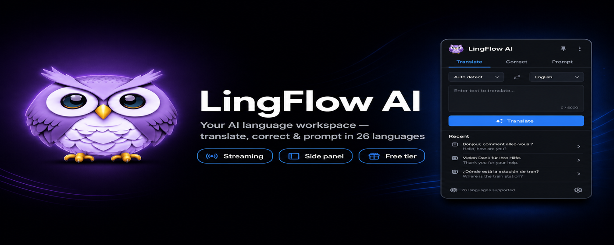

<div align="center">



<h1>LingFlow AI</h1>

<p><strong>AI-powered translation, text correction, and prompt engineering — right in your browser.</strong></p>

<p>
  <a href="#installation"></a>
  <a href="LICENSE"></a>
  
  
  
</p>

<p>
  <a href="#installation">Install</a> ·
  <a href="#features">Features</a> ·
  <a href="#usage">Usage</a> ·
  <a href="#build-from-source">Build from source</a> ·
  <a href="#privacy">Privacy</a>
</p>

</div>

---

LingFlow AI is an open-source, Manifest V3 browser extension that combines AI translation, text correction, OCR, text-to-speech, and prompt engineering (graphics, video & code) in a single workspace. Work from the popup, side panel, or directly on any page.

> **v2.0 UI languages:** English and Polish (`_locales/en`, `_locales/pl`). Translation targets still include 26 languages in the language picker.

### How it works

LingFlow AI supports two tiers:

| Tier | What you get | Requirements |
| --- | --- | --- |
| **Chrome AI (Free)** | Translation via Chrome's built-in Translator API; correction and prompts via Prompt API (limited to supported languages) | Chromium 138+ with Built-in AI. First use downloads the on-device model (~1 GB). No API key. Text stays on-device. |
| **BYOK (Bring Your Own Key)** | Full translation, correction, tone rewriting, prompt engineering, and OCR via OpenAI or Google Gemini | Your own API key. Text sent to the provider over HTTPS. |

> Chrome AI does not send your content to external servers. The browser may need internet on first use to download the on-device model.

## Installation

### Chrome Web Store

1. Visit the **LingFlow AI** listing *(link coming soon)*.
2. Click **Add to Chrome**.
3. Pin the extension for quick access.

### From a release ZIP

1. Download `lingflow-ai-v2.0.0-rc.2.zip` from [GitHub Releases](https://github.com/dilitS/LinkFlowAI/releases).
2. Unzip to a folder.
3. Open `chrome://extensions` → **Developer mode** → **Load unpacked** → select the folder.

### From source

See [Build from source](#build-from-source).

### First-time setup

1. Open the extension → **Settings**.
2. Pick your AI engine:
   - **Chrome AI (Free)** — on-device, no key. Model download progress is shown on first use.
   - **OpenAI** or **Google Gemini** — paste your API key for OCR and full language/tone support.
3. Set default target language and save.

> API keys: [OpenAI](https://platform.openai.com/api-keys) · [Google Gemini](https://aistudio.google.com/app/apikey)

## Features

### Translation

- 26 target languages with auto-detect and swap.
- Tone & register (BYOK only): Auto, Formal, Casual, Business, Friendly.
- Chrome AI uses the native Translator API; unsupported pairs fall back to Prompt API.
- BYOK providers support all pairs with tone control.

### Text correction

- Same source and target language → grammar and style correction.
- Chrome AI: Prompt API (languages: en, ja, es, de, fr).
- BYOK: full model capabilities with tone.

### Prompt engineering

- **Category Pills**: Quick switching between **Graphics**, **Video**, and **Code** prompt domains.
- **Graphics (Nano Banana & Diffusion models)**:
  - *Photo*: Structured formula (Subject, Style, Composition, Lighting, Camera, Constraints).
  - *Graphic design*: Vector, 3D icons, minimal, editorial, and branding visual prompts.
  - *Enhance / Expand*: Turn rough text or tag-lists into full descriptive prompts.
  - *Web UI Mockup*: Clean Dribbble/Behance-level UI mockups (strictly no hands/stock lifestyle clutter).
  - *Mobile App UI*: Flat and isometric mobile screen presentations with touch ergonomics.
  - *4-Screen UI Collage*: Panoramic 16:9 4-screen app showcase (Onboarding, Dashboard, Detail, Profile).
- **Video (Sora, Runway, Kling, Luma, Veo)**:
  - *Cinematic*: Dynamic camera angles, volumetric fog, fluid dynamics, and 60fps lighting cues.
  - *Image-to-Video (I2V)*: Static frame animation with subject consistency.
  - *3D Product Commercial*: Macro studio lighting and luxury industrial design reveal.
  - *Social Media*: High-energy hooks for TikTok, Reels, and Shorts.
  - *Seamless Loop*: Ambient backgrounds, lofi animations, and wallpaper motion.
- **Code (AI Assistants & Design Directives)**:
  - *AI Coding Agent*: Concise, actionable task prompts with signatures, logic, and edge cases.
  - *UI Aesthetic Spec*: Avant-garde design direction, spatial rhythm, and kinetic styling specifications.
- **Inline Controls**: Direct inline aspect ratio selector (`16:9`, `9:16`, `1:1`, `4:5`, `21:9`) and camera motion selector (`zoom-in/out`, `pan`, `tracking`, `orbit`, `fpv`, `static`).

### OCR & screenshot translation (BYOK only)

- Region capture on any page.
- OpenAI or Gemini vision models.
- Transcription + translation with copy and TTS.

### On-page translation

- Floating button on selection, tooltip UI, in-place replace.

### History & TTS

- Persistent history (max 100 items), search, filter, pin.
- Web Speech API or Chrome TTS.

## Usage

| Task | How |
| --- | --- |
| **Translate** | *Translate* tab → languages → text → action button |
| **Fix text** | Same source/target language → **Translate** |
| **Generate prompt** | *Prompt* tab → Category (Graphics/Video/Code) → Type & Parameters → **Generate** |
| **OCR** | Camera icon → drag region (BYOK) |
| **On-page** | Select text → floating button |
| **Side panel** | `Ctrl+Shift+Y` / `Cmd+Shift+Y` |

## Tech stack

- Vanilla ES6+, Tailwind CSS 3.x, Manifest V3
- Chrome Built-in AI, `@google/genai`, OpenAI Chat Completions
- webpack, Vitest, Playwright

Models and defaults: [`popup/modules/constants.js`](popup/modules/constants.js)

## Build from source

**Prerequisites:** Node.js 20+ (see `.nvmrc`), Chromium browser.

```bash
git clone https://github.com/dilitS/LinkFlowAI.git
cd LinkFlowAI
npm install
npm run verify          # lint + test + build + manifest checks
npm run package         # creates releases/lingflow-ai-v<version>.zip
```

**Load unpacked:** `chrome://extensions` → Developer mode → project root folder.

> `popup/output.css` is committed; re-run `npm run build:css` after Tailwind class changes.

**Manual QA:** see [SMOKE-TEST.md](SMOKE-TEST.md).

## Privacy

- **Chrome AI:** on-device processing; model download may use network once.
- **BYOK:** HTTPS to OpenAI or Google. Keys in `chrome.storage.local` (trusted contexts only).
- **No telemetry** by LingFlow AI.

Full policy: [PRIVACY.md](PRIVACY.md) · Contact: `privacy@lingflow.ai`

## Known limitations

- OCR requires BYOK (no on-device vision in v2.0).
- Chrome AI depends on hardware, OS, and browser version.
- Chrome AI Prompt API languages: en, ja, es, de, fr.
- UI localized to English and Polish only in v2.0.
- Provider rate limits apply to BYOK.

## Roadmap

See [ROADMAP.md](ROADMAP.md) and [PLAN-AKTUALIZACJI-V2.md](PLAN-AKTUALIZACJI-V2.md).

## Contributing

See [CONTRIBUTING.md](CONTRIBUTING.md). Run `npm run verify` before opening a PR.

## License

[MIT License](LICENSE)
